# 基于 VirtualBox 的网络攻防基础环境搭建
## 0 实验目的
- 掌握 VirtualBox 虚拟机的安装与使用；
- 掌握 VirtualBox 的虚拟网络类型和按需配置；
- 掌握 VirtualBox 的虚拟硬盘多重加载；

## 1 实验环境
- VirtualBox (6.1.36 r152435 (Qt5.6.2))
- Debian 10 Buster （网关）
- Windows XP SP3 （靶机）
- Kali 2022.3 （靶机 & 攻击者）

## 2 实验过程

### 2.0 网络拓扑
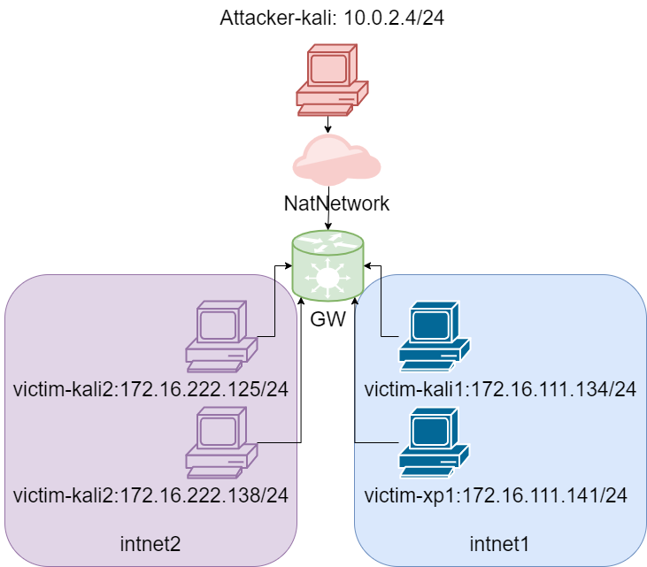

### 2.1 在虚拟机中配置网关设备网卡
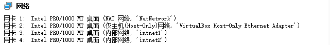
- 网络地址转换（NAT）：用于连接外部网络，与攻击者在同一网络内
  - 10.0.2.15/24

- Host-only：方便宿主机SSH操作网关
  - 192.168.56.113/24

- 内部网络1：作为网关（DNS服务器，DHCP服务器）
  - 172.16.111.1/24

- 内部网络2：作为网关（DNS服务器，DHCP服务器）
  - 172.16.222.1/24

### 2.2 使用多重加载配置靶机与攻击者
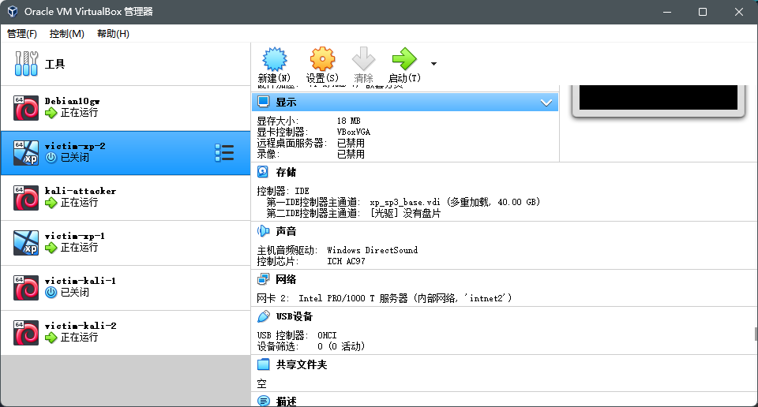
- 不同类型的网卡配置：


| 攻击者  | 靶机  |
|---|---|
| 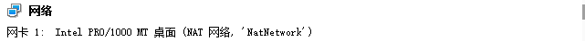  |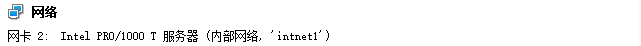   |   

### 2.3 完成网络连通性测试
- [x] 靶机可以直接访问攻击者主机
- [x] 攻击者主机无法直接访问靶机
- [x] 网关可以直接访问攻击者主机和靶机
- [x] 靶机的所有对外上下行流量必须经过网关
- [x] 所有节点均可以访问互联网

#### 2.3.1 靶机可以直接访问攻击者主机
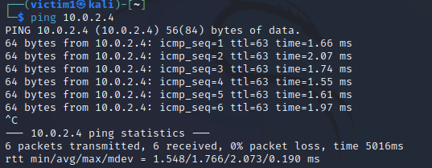

#### 2.3.2 攻击者主机无法直接访问靶机
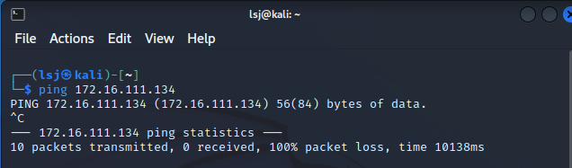

#### 2.3.3 网关可以直接访问攻击者主机和靶机

| 攻击者 | 靶机  |
|---|---|
| 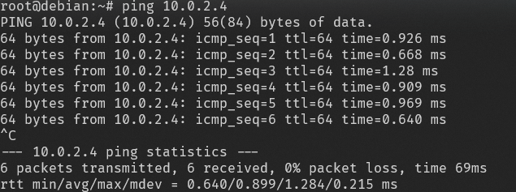  | 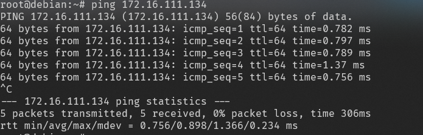  |  

#### 2.3.4 靶机的所有对外上下行流量必须经过网关
在网关上使用`tcpdump`工具进行抓包，在靶机上访问互联网，在`wireshark`中进行分析：
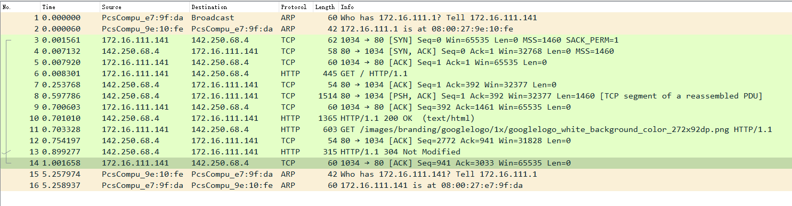
可以看到访问互联网的流量都经过了网关，并且`/var/log/dnsmasq.log`中也记录了网关作为dns服务器进行域名解析的日志
```
Aug  5 14:01:10 dnsmasq[677]: query[A] time.windows.com from 172.16.111.135
Aug  5 14:01:10 dnsmasq[677]: cached time.windows.com is <CNAME>
Aug  5 14:01:10 dnsmasq[677]: cached time.microsoft.akadns.net is 13.70.22.122
Aug  5 14:01:47 dnsmasq[677]: query[A] www.baidu.com from 172.16.222.127
Aug  5 14:01:47 dnsmasq[677]: forwarded www.baidu.com to 192.168.0.1
Aug  5 14:01:47 dnsmasq[677]: reply www.baidu.com is <CNAME>
Aug  5 14:01:47 dnsmasq[677]: reply www.a.shifen.com is 220.181.38.150
Aug  5 14:01:47 dnsmasq[677]: reply www.a.shifen.com is 220.181.38.149
Aug  5 14:06:10 dnsmasq[677]: query[A] www.baidu.com from 172.16.111.135
Aug  5 14:06:10 dnsmasq[677]: cached www.baidu.com is <CNAME>
Aug  5 14:06:10 dnsmasq[677]: forwarded www.baidu.com to 192.168.0.1
Aug  5 14:06:10 dnsmasq[677]: reply www.baidu.com is <CNAME>
```

#### 2.3.5 所有节点均可以访问互联网
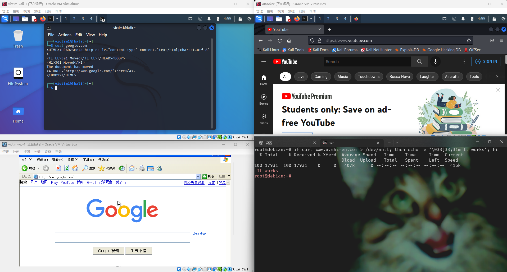

## 3 参考资料
- [VirtualBox Network Settings: Complete Guide](https://www.nakivo.com/blog/virtualbox-network-setting-guide/)
