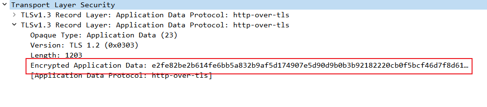

# HTTP 代理服务器实验

## 1 实验目的

- 理解 HTTP 正向代理 HTTPS 流量的特点
- 熟悉代理工具的使用

## 2 实验环境
- Kali 2022.1
- Debian 10
- Tinyproxy 1.11.1
- Mitmproxy 4.0.4
- 2022.7.1-14882 Burp Suite Community Edition

## 3 Tinyproxy 抓包实验

### 3.1 实验拓扑


### 3.2 代理服务器配置 Tinyproxy 服务 
```bash
# 1. 安装 Tinyproxy 
sudo apt update
sudo apt install tinyproxy

# 2. 修改配置文件
# 3. 通过 Systemctl 启动 Tinyproxy
sudo systemctl start tinyproxy
```
取消`Allow 10.0.0.0/8`注释，使得用户能够访问代理服务器


检查代理服务状态和日志


### 3.3 开启 Web 服务器

在 IP 地址为 `172.16.111.134/24` 的主机上开启 Web 服务器
```bash
python -m http.server 8080
```

### 3.4 配置用户主机代理与抓包环境

使用`Chromium`访问网页
```bash
chromium --proxy-server="10.0.2.15:8888" http://172.16.111.134:8080
```


### 3.5 对上述访问过程在用户与 Web 服务器间进行抓包并分析

#### 3.5.1 用户端抓包及分析


通过`Wireshark`抓包发现，用户并没有直接向`172.16.111.134`请求，而是通过`10.0.2.15`代理服务器进行请求

查看使用代理的 HTTP 头


将请求头导出，使用`vimdiff`与普通的 HTTP header 比较


综上使用代理后与不使用代理在用户发送的协议头上有以下区别：
- 连接的不是目标服务器的 IP 地址和端口而是代理服务器IP地址和端口
- 提交的不是相对的地址而是绝对的HTTP地址
- Connection: Keep-Alive 和 Proxy-Connection: Keep-Alive 的区别

#### 3.5.2 服务端抓包及分析


通过 Wireshark 抓包，可以看到服务端没有接收到来自用户 IP 地址发送的包，也就是说用户的 IP 地址通过代理被隐藏了起来


查看代理服务器发送的 HTTP 协议头，发现增加了`Via`字段，Via字段在 [RFC7230](https://www.rfc-editor.org/rfc/rfc7230#section-5.7.1) 中被列为了`MUST`等级：
>  A proxy MUST send an appropriate Via header field, as described
   below, in each message that it forwards.  An HTTP-to-HTTP gateway
   MUST send an appropriate Via header field in each inbound request
   message and MAY send a Via header field in forwarded response
   messages.

在 Tinyproxy 的配置文件中可以选择取消添加或修改Via字段：


## 4 使用代理访问使用 HTTPS 协议的网站

### 4.1 代理服务器抓包

使用 Chromium 设置代理访问 支持 HTTPS 协议的 Web 服务器

```bash
chromium --proxy-server="10.0.2.15:8888" https://www.google.com
```

在代理服务器中抓包并分析：



可以发现，使用 HTTPS 协议的网站传输数据得到了加密，处于中间的代理服务只能看到加密后的数据

### 4.2 用户本机抓包

在用户本机上，是可以通过一些方法将加密后的数据包解密的

首先，向本机中添加一个环境变量`$SSLKEYLOGFILE`
```bash
export SSLKEYLOGFILE="path/to/logfile.log"
```

在系统中设置这个环境变量后，使用Chromium内核的浏览器访问 HTTPS 协议的网站，会将`(Pre)-Master-Secret`自动写入到环境变量对应的路径中

在 Wireshark 的 Edit -> Preferences -> Protocols -> TLS 里，设置 (Pre)-Master-Secret, 路径与上面提及的环境变量里的一致


这样，Wireshark 能够自动将加密的 SSL/TLS 数据包解密


## 5 使用代理进行中间人攻击

### 5.1 Mitmproxy 中间人攻击


如果代理用户相信由代理服务器发送来的代理服务器自己的证书， 这样代理服务器就能以中间人身份抓取 HTTPS 包，并查看明文内容，流程如上图所示。

使用 `mitmproxy`这一工具，能够复现这个过程

首先在代理服务器上安装并开启 mitmproxy 服务

```bash
apt update
apt install mitmproxy

# 打开 mitmproxy 服务，将服务端口设置为 8080
mitmproxy -p 8080
```

在安装 mitmproxy 时，会在`~/.mitmproxy`目录下生成对应的证书和私钥

将 mitmproxy 证书手动添加到用户系统中：


将浏览器代理改成 mitmproxy 对应的端口号：


然后使用浏览器随便访问一些支持 HTTPS 的网站：


上图可以看到，Google 的证书已经变为了 mitmproxy 的证书

在下面的录屏中，记录下了 mitmproxy 抓取到的 HTTPS 数据包，并能够看到这些数据包的明文数据：

[](https://asciinema.org/a/13K61Z1VHIlheRte77e3rUOTR)

mitmproxy 还提供了对数据包篡改的功能，拦截、偷看只是一种基本的应用

### 5.2 Burp Suite 

上述的原理不仅能制造中间人攻击，也能够方便安全人员进行网络应用程序的测试，与 mitmproxy 类似，Burp Suite 也通过代理的方式提供了一套更加自动化的 Web 数据包截获工具


## 6 实验问题

在设置 $SSLKEYLOGFILE 后，使用 Kali 自带的 Firefox 浏览器进行 HTTPS 通信，但并未将 (Pre)-Master-Secret 自动写入到指定的文本文件中去，后来查询得知：

> Kali Linux is a Debian derivative, which doesn’t enable support for an SSLKEYLOGFILE file in Firefox at compile-time. If you don’t want to compile Firefox yourself, you’ll need to install Chromium.

因此我改为使用 Chromium 进行实验

## 7 参考资料

- [TLS - Wireshark Wiki](https://wiki.wireshark.org/TLS)
- [Decrypting SSL/TLS Traffic with Wireshark - Linux Hint](https://linuxhint.com/decrypt-ssl-tls-wireshark/)
- [mitmproxy - an interactive HTTPS proxy](https://mitmproxy.org/)
- [Proxying Hipchat Part 3: SSL Added and Removed Here :^)](https://parsiya.net/blog/2015-10-19-proxying-hipchat-part-3-ssl-added-and-removed-here/)


