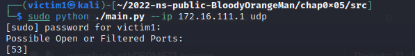
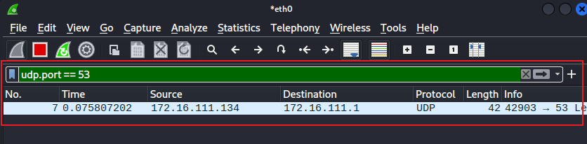
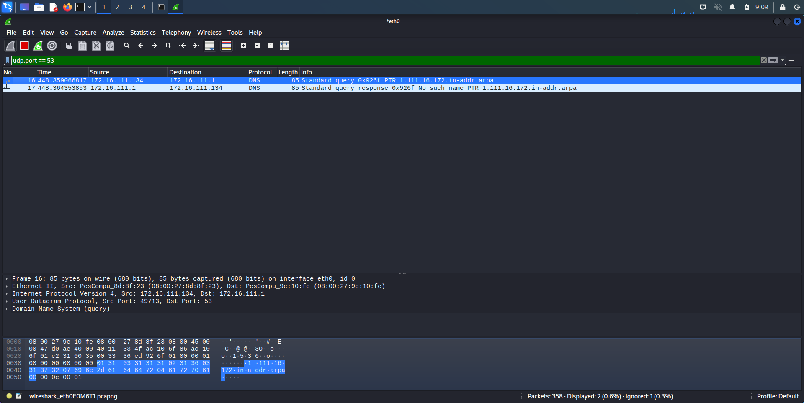
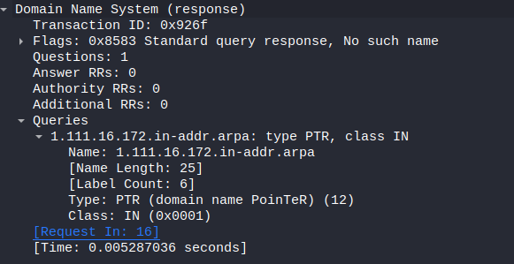
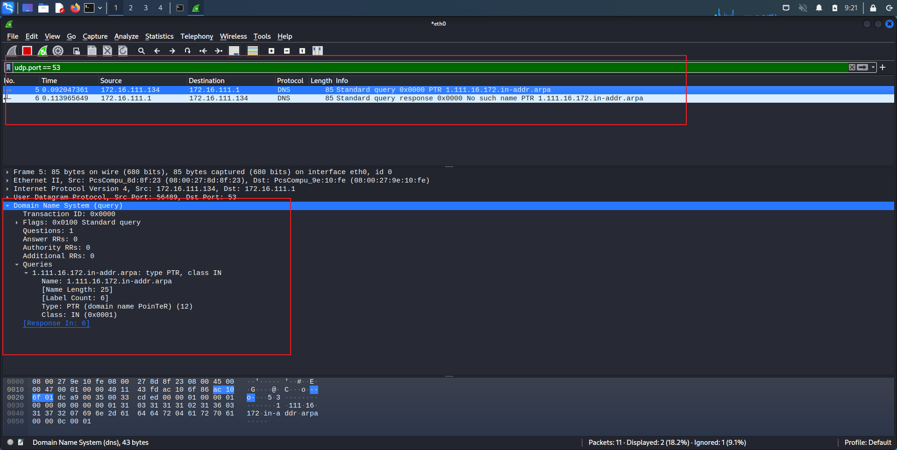
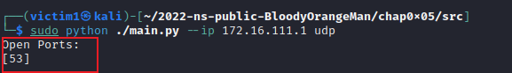

# 基于 Scapy 编写端口扫描器

## 1. 实验环境

- Scapy 2.4.5
- Python 3.10
- 网络拓扑（因为只是为了扫描端口，就化繁为简了）：
  - scanner(172.16.111.134) <--------> server(172.16.111.1)

## 2. 目录结构
``` 
├──  chap0x05
│   ├──  chap0x05.md
│   ├──  pkts
│   │   ├──  connect_CLOSED.pcap
│   │   ├──  connect_FILTERED.pcap
│   │   ├──  connect_OPEN.pcap
│   │   ├──  fin_CLOSED.pcap
│   │   ├──  fin_FILTERED.pcap
│   │   ├──  fin_OPEN.pcap
│   │   ├──  null_CLOSED.pcap
│   │   ├──  null_FILTERED.pcap
│   │   ├──  null_OPEN.pcap
│   │   ├──  syn_CLOSED.pcap
│   │   ├──  syn_FILTERED.pcap
│   │   ├──  syn_OPEN.pcap
│   │   ├──  udp_FILTERED.pcap
│   │   ├──  udp_OPEN.pcap
│   │   ├──  xmas_CLOSED.pcap
│   │   ├──  xmas_FILTERED.pcap
│   │   └──  xmas_OPEN.pcap
│   └──  src
│       ├──  feature
│       │   ├──  __init__.py
│       │   ├──  ack_scanner.py
│       │   ├──  connect_scanner.py
│       │   ├──  fin_scanner.py
│       │   ├──  null_scanner.py
│       │   ├──  syn_scanner.py
│       │   ├──  udp_scanner.py
│       │   ├──  utils.py
│       │   └──  xmas_scanner.py
│       ├──  main.py
│       ├──  ports.txt
│       ├──  ports.txt.backup
│       └──  scan_test.sh
└──  README.md
```

## 3. 实验内容

### 3.1 完成情况

- [x] TCP connect scan 
- [x] TCP stealth scan
- [x] TCP Xmas scan 
- [x] TCP fin scan
- [x] TCP null scan
- [x] UDP scan

### 3.2 执行结果

因为扫描器种类较多，并且每种还对应三种状态，因此我写了一个脚本来展示所有执行结果

防火墙使用的是 `ufw` 程序， tcp 端口使用 `python -m http.server 80` 开启， udp 端口使用 `dnsmasq` 开启

下面测试是对 80 端口进行的：`开放`、`关闭` 和 `过滤` 状态时的程序执行结果（除 UDP scan 之外，UDP scan 使用了 53 端口）：

[](https://asciinema.org/a/Y1MU3Ltxju5Pdzc9kp9wO3Si1)

### 3.3 Scanner 使用方法
```
python main.py --host www.baidu.com 

usage: main.py [-h] (--ip | --host) destination [{fin,connect,xmas,null,syn,udp}]

positional arguments:
  destination
  {fin,connect,xmas,null,syn,udp}
                        Choose the scanning mode

options:
  -h, --help            show this help message and exit
  --ip                  Setting the ip address of the destination
  --host                Setting the hostname of the destination
```

### 3.4 实验分析

#### 3.4.1 过滤状态分析

代码中一些不严谨的地方：

```python
def probe_port(ip, port, result=1):
    src_port = RandShort()
    try:
        p = IP(dst=ip)/TCP(sport=src_port, dport=port, flags='S')
        resp = sr1(p, timeout=2)

        if resp is None:
            result = Port.FILTERED
        elif resp.haslayer(TCP):
            if resp.getlayer(TCP).flags == 0x12:
                send_rst = sr(IP(dst=ip)/TCP(sport=src_port,
                                             dport=port, flags='R'), timeout=1)
                result = Port.OPEN
            elif resp.getlayer(TCP).flags == 0x14:
                result = Port.CLOSED
            elif (int(resp.getlayer(ICMP).type) == 3 and int(resp.getlayer(ICMP).code) in [1, 2, 3, 9, 10, 13]):
                result = Port.FILTERED
    except Exception as e:
        pass

    return result
```

在 `syn(stealth)` ，`connect` 等扫描方式在处理 `No response` 情况时，我的代码简单的将这类情况归为了 `FILTERED` ,但在 [nmap](https://nmap.org/book/synscan.html) 中，不会马上判定该端口为过滤状态，而是设计了一套重传算法，避免是因为网络拥塞而导致的未响应产生的误判：

> The initial SYN is sent first, as usual, but Nmap sees no reply. The response could simply be slow. From previous responses (or timing defaults), Nmap knows how long to wait and eventually gives up on receiving one. A non-responsive port is usually filtered (blocked by a firewall device, or perhaps the host is down), but this one test is not conclusive. Perhaps the port is open but the probe or response were simply dropped. Networks can be flaky. So Nmap tries again by resending the SYN probe. After yet another timeout period, Nmap gives up and marks the port filtered. In this case, only one retransmission was attempted. As described in the section called “Scan Code and Algorithms”, Nmap keeps careful packet loss statistics and will attempt more retransmissions when scanning less reliable networks.

#### 3.4.2 UDP scan 分析

最初我只是简单的构造了 UDP 数据报：

```python
p = IP(dst=ip)/UDP(sport=src_port, dport=port)
```

得到的结果为：



也就是说开在目标主机 53 端口的 `dnsmasq` 服务并没有回应， 因此程序将该端口状态判定为了过滤状态，但目标主机并未开启防火墙

抓包发现：



确实目标服务器并未响应 UDP 数据报

执行 `nmap -sU 172.16.111.1 -p 53` , 并抓包：



Nmap 并未简单的向 53 端口发送 UDP 数据包，而是构造了一个反向 dns 解析，而需要解析的 IP 地址则是对方主机的 IP 地址



查询文档后得知：

>By default, Nmap performs reverse-DNS resolution for every IP which responds to host discovery probes (i.e. those that are online). If host discovery is skipped with -Pn, resolution is performed for all IPs. Rather than use the slow standard DNS resolution libraries, Nmap uses a custom stub resolver which performs dozens of requests in parallel.

因此为了复刻 Nmap 的行为，我将代码改为了：
```python
reverseip = ip
reverseip = reverseip.split('.')
reverseip.reverse()
reverseip = '.'.join(reverseip) + ".in-addr.arpa"
p = IP(dst=ip)/UDP(sport=src_port, dport=port)/DNS(rd=1,qd=DNSQR(qname=reverseip, qtype='PTR'))
resp = sr1(p, timeout=2, verbose=0)
```
这样发送的 UDP 数据报就与 Nmap 类似，并且原先不响应的 dnsmasq 服务也返回了数据报：





可以看到程序已经可以准确识别端口状态了

## 4 实验问题

- UDP 判断出错问题，在 3.4.2 中提到了
- 使用 `netcat` 开启 UDP 端口似乎也不能很好地响应 scanner

## 5 参考资料
- [Python Penetration Testing Cookbook](https://github.com/PacktPublishing/Python-Penetration-Testing-Cookbook)
- [Chapter 5. Port Scanning Techniques and Algorithms](https://nmap.org/book/scan-methods.html)
- [第五章 网络扫描](https://c4pr1c3.github.io/cuc-ns/chap0x05/main.html)